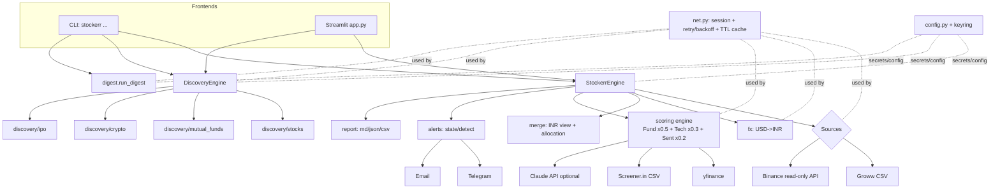

# Stockerr — Technical Architecture

**Status:** Living document · Reflects the implemented system (Python package `stockerr`).

---

## 1. Overview

Stockerr is a single Python package (`src/stockerr/`) with an **adapter-based** design: data sources
implement a common interface, an **engine facade** orchestrates fetch → value → score → report →
notify, and two frontends (a **CLI** and a **Streamlit dashboard**) call the same engine. Everything
is **read-only** and runs locally.



## 2. Module map (`src/stockerr/`)

| Area | Modules | Responsibility |
|---|---|---|
| Core | `models.py` | `Holding`, canonical column schema, `SourceResult` |
| | `config.py` | Non-secret config from env/`.env`; secrets via keyring; `STOCKERR_*` |
| | `net.py` | Shared `requests` session: timeout, retry+backoff (429/5xx), on-disk TTL cache |
| | `logging_setup.py` | Redaction filter (secret keys, Telegram bot-token, Binance signature) |
| | `fx.py` | USD→INR (Frankfurter → erapi fallback → manual) |
| | `merge.py` | Unified INR DataFrame, allocation %, category rollup |
| | `report.py` | Export CSV / JSON / Markdown (+ Claude prompt) |
| | `prices.py` | Live yfinance price refresh for INR stock holdings |
| | `engine.py` | `StockerrEngine` facade: `load_portfolio`, `score`, `execute_pipeline` |
| | `diagnostics.py` | `stockerr doctor` source/channel self-check |
| | `digest.py` | Daily digest: fresh prices → re-score → changes → Telegram+Email |
| | `cli.py` | CLI entry (`init/doctor/run/score/discover/digest/telegram-test`) |
| Sources | `sources/base.py` | `Source` ABC: `fetch_holdings() -> list[Holding]` |
| | `sources/groww_csv.py` | Parse Groww holdings export (stocks + MFs) |
| | `sources/binance_api.py` | Read-only Spot balances (signed GET /api/v3/account) |
| | `sources/groww_api.py` | Stub for optional paid Groww Trading API (not used in v1) |
| Scoring | `scoring/models.py` | `SubScore`, `StockScore` (+ `rationale`/"why") |
| | `scoring/fundamental.py` | Fundamental sub-score from Screener CSV (D/E, ROE, ROCE, FCF, PE) |
| | `scoring/technical.py` | EMA50/200 + RSI from yfinance |
| | `scoring/sentiment.py` | News → Claude classification (optional) |
| | `scoring/engine.py` | Combine sub-scores (0.50/0.30/0.20), `build_rationale`, rank |
| Discovery | `discovery/engine.py` | `DiscoveryEngine`: stocks/mf/crypto/ipo |
| | `discovery/stocks.py` | Buffett screen: quality+valuation+technical+consistency |
| | `discovery/valuation.py` | Graham number + margin of safety |
| | `discovery/consistency.py` | Multi-year (3-4yr yfinance) consistency sub-score |
| | `discovery/universe.py` | Cap tiers (AMFI file or market-cap thresholds) |
| | `discovery/mutual_funds.py` | NAV metrics (CAGR, rolling, Sortino, drawdown) + score |
| | `discovery/crypto.py` | Binance klines momentum + rel-strength vs BTC + CoinGecko cap |
| | `discovery/ipo.py` | Upcoming IPO normalize/score/fetch (NSE `nse` / IPO Guru) |
| Alerts | `alerts/state.py` | Snapshot store for day-over-day diffing |
| | `alerts/detect.py` | Drift / price-move / high-score alert rules |
| | `alerts/email.py`, `alerts/telegram.py` | SMTP + Bot API channels (+ `telegram-test` helpers) |

## 3. Data model

**Canonical holding row** (`models.py::CANONICAL_COLUMNS`):
`asset, symbol, category(stock|mf|crypto), quantity, price_native, currency, price_inr, value_inr, source`

- Each source returns `Holding` rows in native currency; `merge.build_dataframe` applies FX
  (`{INR:1, USD:fx_rate}`) → `price_inr`, `value_inr`, `alloc_pct`, and a `groupby(category)` rollup.
- **Scores:** `SubScore(name, available, score 0-100, detail, note)`; `StockScore(symbol, confidence,
  fundamental, technical, sentiment, notes, rationale)`.

## 4. Data flows

- **Portfolio:** `build_sources()` → `_fetch_all()` (per-source try/except) → `_resolve_fx()` →
  `merge` → `PortfolioResult(df, cat_df, fx, source_results, generated_at)`.
- **Confidence (holdings/watchlist):** `score_stocks()` → per symbol: `score_fundamental` (Screener
  CSV) + `score_technical` (yfinance) + `score_sentiment` (Claude, optional) → `combine` (renormalized
  weights) + `build_rationale`.
- **Discovery (stocks):** `screen_stocks(csv)` → quality (fundamental) + valuation (Graham MoS) →
  rank; `--enrich` adds technicals + multi-year consistency for the top N (throttled).
- **Digest:** `run_digest()` → `load_portfolio(live_prices=True)` → `score` → snapshot diff
  (`alerts`) → `build_digest` text → `report.write_reports` → `send_telegram` + `send_email`.

## 5. Data sources

| Source | Purpose | Auth | Reliability / limits |
|---|---|---|---|
| Groww holdings **CSV** | Stocks + MFs holdings | none (manual export) | Manual; user updates on trade |
| **Binance** Spot (`api.binance.com`) | Crypto balances + prices | HMAC-SHA256 (read-only key) | Official; 6000 wt/min; India Spot only |
| Binance market mirror (`data-api.binance.vision`) | klines/24h/exchangeInfo | none | Public market data only |
| **yfinance** (`*.NS`) | Prices, technicals, some fundamentals, 3-4yr financials | none | Rate-limited (429); Indian gaps |
| **Screener.in** export CSV | Fundamentals (PE/D-E/ROE/ROCE/FCF) | none (manual export) | Reliable; manual refresh |
| **mfapi.in** | MF NAV history + category | none | Hobby API, no SLA → cached |
| **AMFI** categorization | Large/Mid/Small cap tiers | none | Official, twice-yearly file |
| **NSE `nse` lib** | Upcoming/current IPO calendar + subscription | cookie handshake (lib) | Unofficial; throttled |
| **IPO Guru** API | IPO dates/price/subscription/GMP | free `X-API-KEY` | Permits programmatic use |
| **CoinGecko** | Crypto market-cap rank/tier | free demo key (optional) | 5-15/min keyless; 100/min demo |
| **Frankfurter / open.er-api** | USD→INR | none | ECB daily; cached 1h |
| **Claude API** (Anthropic) | News sentiment; `--analyze` | API key (optional) | Paid; graceful if absent |

## 6. Scoring (summary)

- **Holdings confidence** = `Fundamental×0.50 + Technical×0.30 + Sentiment×0.20`, renormalized over
  available sub-scores. Signal: >75 Strong Buy · 50–75 Hold · <50 Avoid.
- **Discovery stocks** = `quality×0.45 + valuation×0.35 + technical×0.20 + consistency×0.20`
  (renormalized). Valuation = Graham number `sqrt(22.5·EPS·BVPS)` → margin of safety. **Thin-data
  guard:** confidence scaled down when <3 of {5 quality metrics + valuation} present; labeled
  "Insufficient"; never "Strong Buy" without a valuation.
- **MF** = rolling-return consistency (30%) + risk-adjusted Sortino/Sharpe (30%) + drawdown (25%) +
  low TER (15%). **Crypto** = 70% trend/RSI + 30% relative strength vs BTC. **IPO** = RoNW + D/E
  quality (subscription surfaced separately; GMP flagged unofficial).

## 7. Cross-cutting

- **Networking:** all HTTP via `net.get/get_json` — one session, timeouts, retry+backoff on 429/5xx,
  optional TTL cache (FX 1h, exchangeInfo 1d, NAV 6h, CoinGecko 1h). Binance account is **never cached**.
- **Config/secrets:** `config.load_config()` reads `STOCKERR_*` env (via `.env`); secrets from OS
  keyring (service `stockerr`) with `STOCKERR_<NAME>` env override. See `SECURITY_AND_ACCESS.md`.
- **Testing:** `pytest` (60 tests) with fixtures per source (Binance JSON, Groww/Screener/AMFI CSV,
  synthetic NAV/klines/financials, IPO records). Streamlit checked via `AppTest`.
- **Deployment:** local via `uv`; daily automation via Windows Task Scheduler → `run-digest.bat` →
  `stockerr digest`. Dashboard: `uv run --extra ui streamlit run app.py` (localhost only).

## 8. Directory tree

```
Stockerr/
├─ app.py                      # Streamlit dashboard
├─ run-digest.bat              # Task Scheduler entry
├─ pyproject.toml              # uv; extras: ui, scoring, discovery, groww-api, analyze, dev
├─ .streamlit/config.toml      # dark theme
├─ .env.example                # non-secret config template
├─ src/stockerr/               # package (see module map)
├─ tests/                      # pytest + fixtures
├─ docs/                       # PRD, architecture, security, frontend, tickets
├─ data/     (gitignored)      # groww_holdings.csv, screener_screen.csv
├─ exports/  (gitignored)      # generated reports
└─ state/    (gitignored)      # snapshots, logs
```
